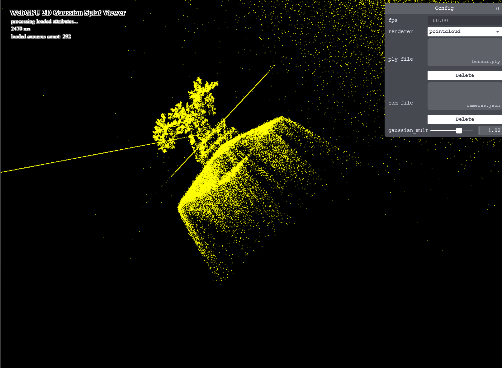
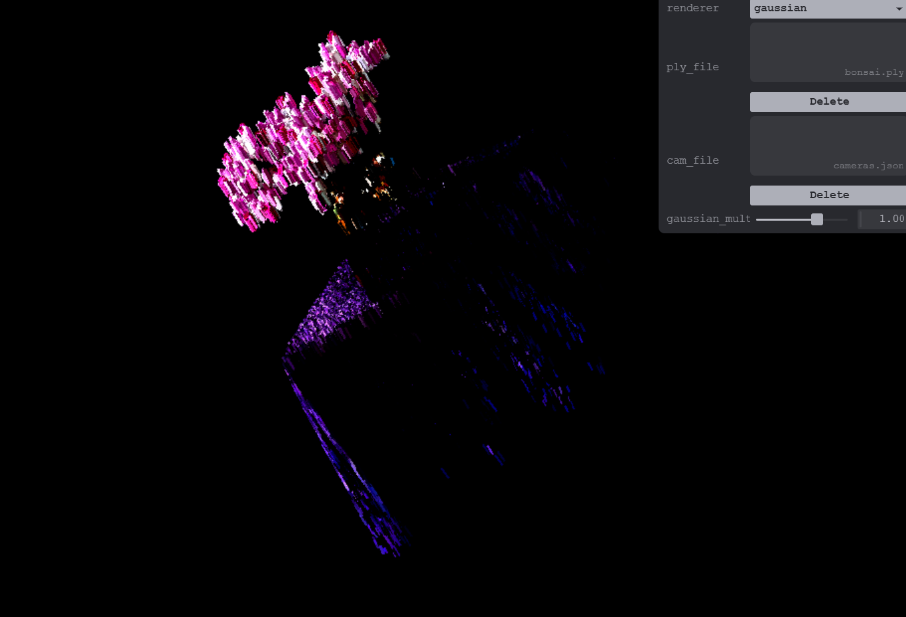

# Project5-WebGPU-Gaussian-Splat-Viewer

**University of Pennsylvania, CIS 565: GPU Programming and Architecture, Project 5**

* Cindy Wei
* Tested on: **Google Chrome 128.0** on
  Windows 11, i7-13700K @ 5.4GHz 32GB, RTX 4080 16GB (Personal Machine)

### Live Demo

[View Live Project]([https://chapiniwei50.github.io/Project5-WebGPU-Gaussian-Splat-Viewer/])

### Demo Video/GIF

https://youtu.be/IgWtlDe2ayY

## Project Description
This project implements a real-time 3D Gaussian Splat Viewer using WebGPU, based on the 3D Gaussian Splatting technique. The viewer loads and renders pre-trained Gaussian scene files with sorting and basic rendering. **Note: We were unable to achieve smooth surfaces and proper blending - the implementation currently renders as discrete particles rather than continuous surfaces.**

## Features Implemented

### Part 1: Point Cloud Renderer
- MVP calculation in vertex shader
- Point cloud visualization

### Part 2: Gaussian Splat Renderer
- **Preprocessing Compute Shader**:
  - View frustum culling with 1.2x bounding box
  - 3D covariance computation from rotation and scale
  - 2D conic and quad size calculation in NDC space
  - Spherical harmonics color evaluation
  - Storage of 2D Gaussian data for rasterization

- **Rendering Pipeline**:
  - Depth-based sorting using radix sort
  - Indirect draw calls with dynamic instance count
  - Quad reconstruction in vertex shader
  - Basic fragment shader implementation
  - **Implementation Limitation**: Failed to achieve proper conic-based splat evaluation and smooth surface blending

## Screenshots

**Point Cloud**

**Gaussian**

## Performance Analysis

### 1. Renderer Comparison
- **272K Gaussians**: Point Cloud ~60 FPS, Gaussian Renderer 58-61 FPS
- **1.06M Gaussians**: Point Cloud ~60 FPS, Gaussian Renderer 14-19 FPS
- Gaussian rendering provides color but at significant performance cost with larger scenes

### 2. Gaussian Count Scaling
Performance scales inversely with Gaussian count:
- **272K Gaussians**: 58-61 FPS
- **1.06M Gaussians**: 14-19 FPS
- 4x more Gaussians results in 3-4x performance drop

### 3. View-Frustum Culling Effectiveness
- **Bonsai Scene**: 96.6% of Gaussians rendered (3.4% culled)
- **Bicycle Scene**: 100% of Gaussians rendered (0% culled)
- Current culling implementation is largely ineffective

### 4. Performance Characteristics
- **Bonsai (272K)**: Average frame time 16-17ms
- **Bicycle (1.06M)**: Average frame time 60-62ms
- Major bottleneck is Gaussian processing and sorting overhead

## Technical Challenges
- **Conic Evaluation**: Unable to properly implement the conic matrix evaluation in the fragment shader
- **Blending Pipeline**: Challenges with alpha blending and proper transparency sorting
- **Surface Continuity**: Failed to achieve smooth surface reconstruction from individual splats
- **Culling Optimization**: View-frustum culling requires improvement for better performance

### Credits

- [Vite](https://vitejs.dev/)
- [tweakpane](https://tweakpane.github.io/docs//v3/monitor-bindings/)
- [stats.js](https://github.com/mrdoob/stats.js)
- [wgpu-matrix](https://github.com/greggman/wgpu-matrix)
- Special Thanks to: Shrek Shao (Google WebGPU team) & [Differential Guassian Renderer](https://github.com/graphdeco-inria/diff-gaussian-rasterization)
